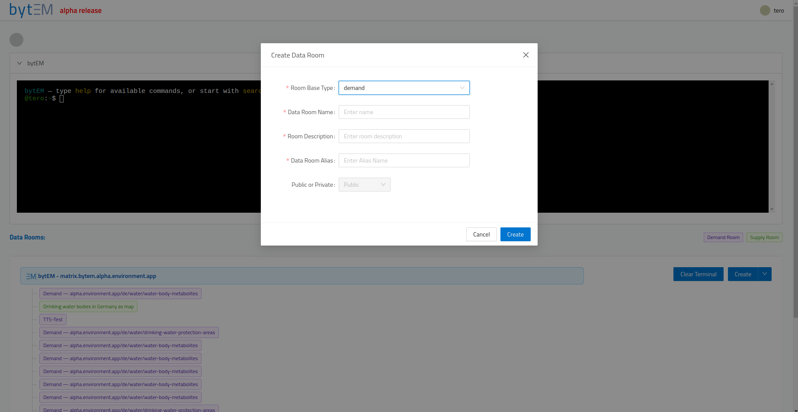
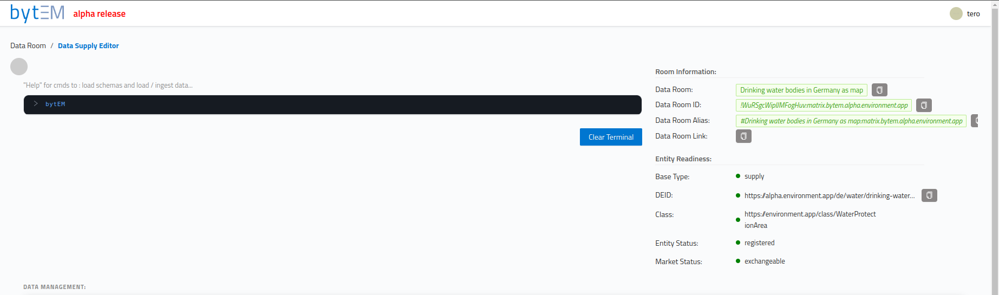
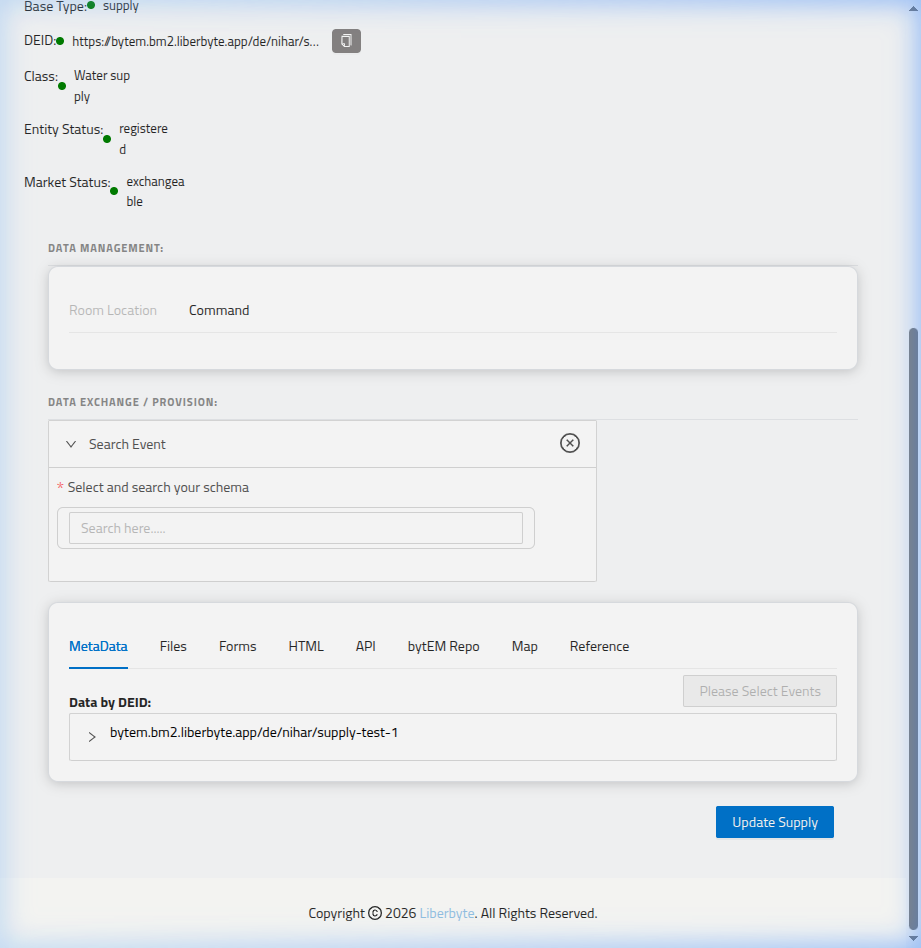
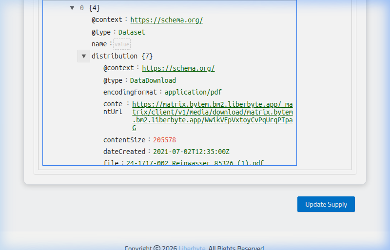
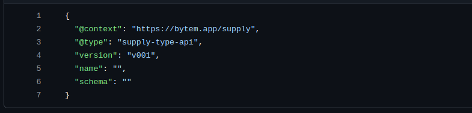
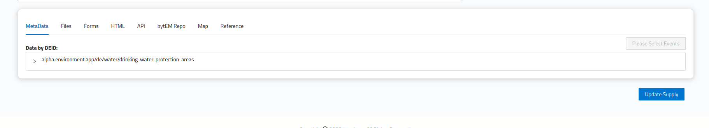

# bytEM User Guide for bm1 Server — bytEM OUDEA Client (alpha version)

> ⚠️ **bytEM OUDEA alpha** — the platform is under ongoing, continuous change. This guide will keep being updated as features evolve; if something here doesn't match exactly what you see in the app, that's likely why.

> This guide is for people **using** the **bm1** bytEM instance at `https://bytem.bm1.liberbyte.app` — logging in, creating Supply/Demand rooms, exchanging data, and using the bytEM app (which also acts as a Matrix client). It does not cover server installation; ask your administrator for your login credentials. Creating a Supply Room requires your own bytEM account; accessing **public** Demand Rooms can also be done with an existing matrix.org (or other federated Matrix) account, if federation is set to open or whitelisted.

> Some commands and actions require sufficient permissions in a room (your Matrix "power level"). If a command reports that you don't have permission, ask the room owner/administrator.

> **The reliable way to get data is the index/DEID self-service flow** (open `/pwa/index-room`, pick a DEID, and the Demand Room + exchange are created for you automatically — see [Section 5a](#5a-self-service-data-access-the-index-room--deid-flow)). A Demand Room you create **manually** does **not** have a reference DEID, so `find` and `exchange-data` have nothing to act on inside it — this is covered in [Section 8](#8-how-supply-and-demand-exchange-data).

> **How to read the status tags in this guide:**
> - ✅ **active** — present and working in the current build (verified against the live instance / test run).
> - ⚙️ **bot-side** — processed server-side by the bytEM bot (not in the frontend); behaviour confirmed via the live `help` output.
> - ⛔ **disabled / not used** — present in the code but switched off or not part of the bytEM OUDEA workflow in the current version.
>
> Tags reflect a review of the live `bm1` build plus Liberbyte's own notes. Because this is a fast-moving alpha, always trust the live `help` command over any printed list.

---

## Table of Contents

1. [What is bytEM?](#1-what-is-bytem)
2. [Logging In](#2-logging-in)
3. [Overview Page](#3-overview-page)
4. [Supply Rooms vs Demand Rooms](#4-supply-rooms-vs-demand-rooms)
5. [Creating a Data Room](#5-creating-a-data-room)
   - 5a. [Self-Service Data Access (Index Room / DEID flow)](#5a-self-service-data-access-the-index-room--deid-flow)
6. [Supply Room — Data Supply Editor](#6-supply-room--data-supply-editor)
7. [Demand Room — Data Demand Editor](#7-demand-room--data-demand-editor)
8. [How Supply and Demand Exchange Data](#8-how-supply-and-demand-exchange-data)
9. [Terminal Commands Reference](#9-terminal-commands-reference)
10. [PWA — Mobile App](#10-pwa--mobile-app)
11. [Tips, Limits & What the Colors Mean](#11-tips-limits--what-the-colors-mean)
12. [Getting Help](#12-getting-help)

---


## 1. What is bytEM?

bytEM is a decentralised platform for sharing and exchanging data between organisations — think of it as "email for data," or as an extension of your own website that makes your organisation's data (datasets, APIs, etc.) exchangeable. It is built around two basic ideas:

- **Supply Room** (you provide data) — where you publish data you want to make available (e.g. a utility publishing water quality readings).
- **Demand Room** (you subscribe to data via exchange) — where you request and receive data you need (e.g. a city publishing water quality data for citizens to access via an exchange). There is essentially an unlimited number of real-world use cases for exchanging, processing, and analysing data — these are just examples.

Once a Supply Room and a Demand Room are linked through an **Exchange**, the relevant metadata (describing the actual data, e.g. an API or dataset) flows from the supplier to the consumer — no direct file sharing happens outside of that.

---

## 2. Logging In

**URL:** `https://<your-bytem-domain>/user/login`

1. Open the login page in your browser.
2. **Homeserver** field — leave this as the pre-filled default. It points to your organisation's bytEM server and should not normally be changed. You can change the homeserver URL if you want to log in from any other Matrix Synapse server via username and password
3. Enter your **Username**.
4. Enter your **Password**. Use the **eye icon** (👁) on the right of the password field to toggle password visibility — helpful for checking what you've typed.
5. Optionally tick **Remember me** to stay signed in on this device.
6. Click **Sign In**.


On success you land on the **Overview** page. If login fails, double-check your username/password with your administrator, or try a hard refresh of the page (Ctrl+Shift+R) — first-time logins after a server update sometimes need this to clear a cached page.


> Public Demand Rooms can also be accessed by any federating Matrix instance (e.g. a Synapse installation) using that instance's own username — e.g. `@user:matrix.org` — when your bytEM server has federation set to open or whitelisted.

---

## 3. Overview Page

**URL:** `https://<your-bytem-domain>/overview`


> The layout is a **single-column** design: the terminal sits at the top full-width, with the Data Rooms list below it.


### The Terminal
A command-line interface for your account. The welcome hint reads *"type help for available commands, or start with search / find."* Type `help` to see the commands available in the current context. The terminal is also available inside Supply and Demand rooms, with extra room-specific commands (see [Section 9](#9-terminal-commands-reference)).

### Data Rooms List
Shows every Supply and Demand room you belong to.
- 🟢 **Green tag** = Supply Room
- 🟣 **Purple tag** = Demand Room
- 🟢 **Light green tag** = The light green tag shows that you are not a member of the room, but you can join by clicking it and selecting the join option from the drop-down menu.

**Click any room** to open a context menu:

> ⚠️ **Usability note:** if you have just typed in the terminal, the terminal still holds keyboard focus and clicking a room tag does **nothing**. Click a neutral spot first (e.g. the **DATA ROOMS:** label) to release focus, *then* click the colored room tag — the context menu will open.

| Option | What it does |
|---|---|
| **Open Data Room** | Opens the room's editor screen |
| **Edit Data Room Name** | Renames the room |
| **Copy Room ID** | Copies the room's unique Matrix ID to your clipboard |
| **Leave Data Room** | Removes you from the room (the room and its data still exist) |
| **Delete Data Room** | Permanently deletes the room and everything in it — cannot be undone |

> "Leaving" and "deleting/removing" a room follow the underlying Matrix protocol's definitions of those actions.

### Buttons
| Button | Action |
|---|---|
| **Create ▾** | Opens the "Create Data Room" dialog |
| **Clear Terminal** | Clears the terminal's output history (does not affect your data) |

> "Creating a room" likewise follows the Matrix protocol's room-creation mechanics.

---

## 4. Supply Rooms vs Demand Rooms

| | Supply Room | Demand Room |
|---|---|---|
| **Who uses it** | Data providers (e.g. a utility, a sensor network) | Data consumers (e.g. a city, an analyst) |
| **Purpose** | Publish data so others can find, exchange, and use it | Request/subscribe to data that already exists |
| **Tag color** | 🟢 Green | 🟣 Purple |
| **Main action** | Set up DEID + Class, then add a supply-type (dataset upload, API reference, etc.) so the data is exchangeable via your DEID | Get a Demand Room via the index/DEID flow, then request an Exchange |
| **Becomes useful when** | Fully configured (DEID, Class, data uploaded) and listed as `exchangeable` | Created with a reference DEID (via the index flow) and linked to a Supply Room via Exchange |

A single bytEM account can own and manage any number of Supply and Demand rooms at once. The Matrix protocol still applies at the room level (e.g. user power levels).

You cannot create a supply room without a valid deid url. This deid url can either be an existing deid url from your organization or you can create a new deid url by using the new-deid command in the terminal. 
---

## 5. Creating a Data Room

1. On the Overview page, click **Create ▾** → **Create Data Room**.
2. Fill in the dialog.

The dialog is the same for both room types — pick the **Room Base Type** (`supply` or `demand`) and fill in the rest. **Room Type** and **DEID URLs** only appear when you choose `supply`:

| Field | Description |
|---|---|
| **Room Base Type** | `supply` (you provide data) or `demand` (you request data) |
| **Data Room Name** | A human-readable name, e.g. `Berlin Water Quality` or `City Planning Data Request` |
| **Room Description** | What this room is for, e.g. `Water quality data for Berlin` |
| **Data Room Alias** | A short ID (auto-suggested, editable) — keep the auto-suggestion |
| **Room Type** | *(Supply only)* The kind of data entity — the dropdown may default to `entity`; choose **`dataset`** for now |
| **DEID URLs** | *(Supply only)* The URL identifying your data source/schema (see [Section 6](#deid--what-url-to-use)). Pre-filled with your instance's base domain, e.g. `https://bm1.liberbyte.app/de/test_1` |
| **Public or Private** | Visibility — **Private** is the default for Supply rooms; **Public** is typical for Demand rooms so suppliers can discover them |

> **Data Room Alias:** use the auto-suggested alias rather than overwriting it — it's generated to satisfy Matrix protocol room-alias requirements.

> **DEID (Supply only):** the DEID URL uses your instance's base domain **without** any `bytem.` prefix (e.g. `https://bm1.liberbyte.app/de/test_1`), or a published schema domain such as `https://alpha.environment.app/de/deid-1`. The field is pre-filled with your instance's base domain to make this easy. See ["What URL to use"](#deid--what-url-to-use) in Section 6 for the full rule.

> `exchange` and `registry` room types appear in the dropdown but are not for general use — `exchange` is shown disabled, `registry` is admin-only.

> ⚠️ **A Demand Room you create manually here cannot pull data on its own.** It has no reference DEID, so `find` and `exchange-data` have nothing to act on inside it. To actually receive data, use the index/DEID flow in [Section 5a](#5a-self-service-data-access-the-index-room--deid-flow) — that creates a Demand Room *with* a reference DEID and runs the exchange for you. Manual creation is mainly useful for setting up a room's name/description/visibility ahead of time.




3. Click **Create**. The room appears immediately in your Data Rooms list with the matching color tag (🟢 green = supply, 🟣 purple = demand).

---

## 5a. Self-Service Data Access (the Index Room / DEID flow)

> ⭐ **This is the recommended way to get data.**

This is the **primary, reliable way** to get a Demand Room with real exchanged data in it — no terminal commands needed. You pick the DEID you want from the public index, and bytEM creates the Demand Room *and* runs the exchange for you automatically.

**Why this is the recommended path:** when the Demand Room is created this way, it is automatically given a **reference DEID** — the pointer to the supply data you asked for. That reference DEID is exactly what `find` and `exchange-data` need to act on. A Demand Room you create **manually** (Section 5) has no reference DEID, so running those commands inside it does nothing useful. So: to actually pull data, start from the index here, not from a hand-created Demand Room.

This only works for Supply Rooms that are fully "ready" — see the checklist below.

### Step 1 — Make your Supply Room exchangeable (provider side)

Before any Supply Room shows up for self-service access, its provider must:

1. Create the Supply Room with a **DEID on your instance's own base domain** (no `bytem.` prefix — see ["What URL to use"](#deid--what-url-to-use) in Section 6).
2. Set the room's **Class** ([Section 6](#setting-the-class)).
3. Upload/ingest the actual data (`load-supply dataset`, etc.) and click **Update Supply**.
4. Keep updating the Supply Room until every row in the **Entity Readiness** panel is green — Base Type, DEID, Class, Entity Status, and Market Status all need to show a green dot (see [Section 11](#11-tips-limits--what-the-colors-mean) for exactly what each color means). Market Status in particular needs to reach `exchangeable`, not just `draft` or `advertised`.

Once Market Status is `exchangeable`, the room is automatically listed on the public index page at:

```
https://<your-bytem-domain>/pwa/index-room
```

Each listing card shows the DEID (as a readable label), a status badge (`exchangeable` in green, `draft` in blue), and the room's Class/domain tags.


### Step 2 — Request access (consumer side)

1. Open `https://<your-bytem-domain>/pwa/index-room` and click **Access data →** on the listing you want. This opens `/deid/<the-deid-path>` — a public page, no login required yet.
2. The page shows a **Dataset Info** box at the top with the data entity's type (e.g. `entity`), giving you a quick overview of what you're requesting.
3. Fill in the short form:

   | Field | Required? | Notes |
   |---|---|---|
   | **Matrix username** | Yes | Your existing Matrix account (e.g. `@you:matrix.example.org`) — this flow does **not** create an account or set a password for you; you must already have one on some Matrix homeserver |
   | **Email** | No | Optional, for your own records — not used to create an account |
   | **Location** | Yes | Click a point on the map, or type latitude/longitude directly. If the Supply Room already published a location, the form pre-fills it — you can still adjust it |

4. Click **Access My Data Room** (disabled until username + a location are filled in). A *"🔒 Secure · Private · You control your data"* note sits below the button.


### Step 3 — Watch the live orchestration console

After clicking, the page polls a status endpoint and walks through a checklist in real time:

| Step shown | What's actually happening |
|---|---|
| Waiting in queue | Your request has been accepted and queued |
| Finding or reusing demand room | (Currently always creates a new room — see note below) |
| Creating demand room | A brand-new Matrix room is created for this request |
| Setting DEID | The new Demand Room is tagged with the reference DEID you requested |
| Resolving data source | The matching Supply Room is located. If none is exchangeable for this DEID, this step fails with *"No supply available for this DEID"* |
| Exchanging data | The actual exchange runs automatically (an "auto-exchange") — equivalent to the Supply side's data being pushed into your new room |
| Setting permissions | Your account is added to the room at a restricted permission level (see note below) |
| Inviting you — auto-accepting invitation | You're invited into the room, and the invitation auto-retries if Matrix rate-limits it |
| Done | Your Demand Room is ready |

> **Room reuse — open question:** in the current version every self-service request creates a brand-new Demand Room, even for a DEID you've requested before. Whether the same DEID should reuse an existing Demand Room instead is still being decided by the team — expect this behaviour to change.

> **Permissions:** you're added with Matrix power level 51, while the room's default `events_default` is 50 — so despite being described as "read-only" access, you technically *can* send events into the room (51 ≥ 50). Don't rely on this room being strictly locked down to viewing only.

> **Guest access is explicitly forbidden** on these self-service-created rooms. (Guest access on manually-created Demand Rooms is in any case ⛔ disabled for this version — see [Section 7](#guest-access).)

### Step 4 — Explore the data room

Once the checklist reaches **Done**, you'll see a success screen with:

- **Explore `<DEID>` by bytEM** button — takes you to a login page (`/user/login?roomId=...&matrix_user=...`) with your homeserver and username pre-filled from what you entered. You still need to **type your actual Matrix password** — no password is auto-created for you in this flow. After logging in, you're redirected straight into `data-editor/demand/{roomId}` — the new Demand Room, with the invite already auto-accepted, so there's no separate "accept invite" step.
- **↗ Open in Element or another Matrix client** link — a `matrix.to` link, if you'd rather view the room in your own Matrix client instead of the bytEM app.

From there, the Demand Room behaves like any other Demand Room — see [Section 7](#7-demand-room--data-demand-editor) for every tab and button inside it.

---

## 6. Supply Room — Data Supply Editor

**URL:** `https://<your-bytem-domain>/data-editor/supply/{roomId}`

Open by clicking a 🟢 green room → **Open Data Room**.




### Room Information Panel (right side)

| Field | Description |
|---|---|
| **Data Room** | The room's display name (e.g. `asset_202606010_17`), with a copy button |
| **Data Room ID** | The room's unique Matrix ID (e.g. `!FPzEXMjFkbwNzLgjdD:matrix.bytem.bm1.liberbyte.app`) — needed for some terminal commands and exchange links |
| **Data Room Alias** | A short, human-readable alias (e.g. `#asset_202606010_17:matrix.bytem.bm1.liberbyte.app`) |
| **Data Room Link** | A shareable link directly to this room's editor |

### Entity Readiness Panel

This shows how complete and "live" your Supply Room is. Each row has a colored dot:

| Indicator | What it tracks |
|---|---|
| **Base Type** | Confirms this room is a Supply room. Always green once created — no action needed. |
| **DEID** | Whether a Data Entity ID has been set for this room (see below) |
| **Class** | Whether a data classification has been set for this room (see below) |
| **Entity Status** | Whether your data entity (with its DEID) has been reserved and registered at the bytEM level, and ultimately in the global address space |
| **Market Status** | Whether this room is listed in the wider bytEM market/federation and open for exchange |


> **Example from bm1:** A fully configured Supply Room on bm1 shows:
> - **Base Type:** 🟡 `supply`
> - **DEID:** 🟢 `https://bm1.liberbyte.app/de/t...` (truncated in the UI; click copy to see the full URL)
> - **Class:** 🟢 `bm1_test_17`
> - **Entity Status:** 🟢 `registered`
> - **Market Status:** 🟢 `exchangeable`


> **Making your room exchangeable:** To move all indicators to green (🟢), you must complete these steps in order:
> 1. Set the **DEID** (`room-deid --schema` → edit → save)
> 2. Set the **Class** (`room-class --schema` → edit → save)
> 3. Upload / ingest data (use `load-supply dataset` or the **Files** tab)
> 4. Click **Update Supply** to push your changes
>
> Once all five indicators show green, and Market Status shows `exchangeable`, the room appears on the public index at `https://bytem.bm1.liberbyte.app/pwa/index-room`.

See [Section 11](#11-tips-limits--what-the-colors-mean) for what each color actually means and what to expect.

### Setting the DEID

The **DEID** (Data Entity ID) identifies what your data is and where it logically belongs. You can set it two ways — using the terminal, **or** the **Save** button in the DEID editor (Command tab):

```bash
room-deid --schema      # ✅ Fetches the DEID template for this room
room-deid --save        # ⚙️ Saves the DEID you've filled in (or just click the Save button)
```

> 💡 You don't have to type `room-deid --save` — after editing the DEID in the Command tab you can simply click its **Save** button.

Running `--schema` prints a fillable template, e.g.:

```json
{
  "@context": "https://bytem.app/room",
  "@type": "room-deid",
  "state_key": "bytem.app.room-deid",
  "deid": "<your-deid-url-here>",
  "version": "v001"
}
```

**What URL to use:** <a name="deid--what-url-to-use"></a> the `deid` value is a URL on your instance's **base domain, without any `bytem.` prefix** — or a published schema domain. For an instance served at `bytem.bm1.liberbyte.app`, valid DEIDs look like:

```
https://bm1.liberbyte.app/de/test_1
https://bm1.liberbyte.app/de/berlin/water
https://alpha.environment.app/de/deid-1
```

The Create-Data-Room dialog pre-fills the DEID field with your instance's base domain, so you usually just append a path. The path after the domain can be anything that meaningfully describes your data.

After editing the `deid` field, run `room-deid --save` or click **Save** to store it.


### Setting the Class

The **Class** describes what category of data this room provides. You can set it via the terminal **or** the **Save** button in the Class editor:

```bash
room-class --schema     # ✅ Fetches the Class template for this room
room-class --save       # ⚙️ Saves the Class you've filled in (or just click the Save button)
```

> 💡 As with the DEID, you can click the **Save** button instead of typing `room-class --save`.

The template looks like:

```json
{
  "@context": "https://bytem.app/room",
  "@type": "room-class",
  "state_key": "<your-domain>",
  "domain": "<your-domain>",
  "class": "<category>",
  "uri": "<a-url-on-your-domain>",
  "version": "v001"
}
```

- **domain** — your bytEM instance's base domain (no `bytem.` prefix, same rule as DEID, e.g. `bm1.liberbyte.app`).
- **class** — a category for your data, e.g. `environment`.
- **uri** — a URL on the same domain describing this specific entry; reusing your room's own DEID URL here is a safe, working choice.

Run `room-class --save` (or click **Save**) once the fields are filled in.

> Organisations running bytEM can publish their own Classes, as long as they follow valid Class syntax. For an example of a real Class document, see [Liberbyte's `alpha.environment.app` repo on Codeberg](https://codeberg.org/Liberbyte/alpha.environment.app/src/branch/main/class) (a free Codeberg account is needed to browse it; schema repos are made public after the alpha phase).

### Uploading / Ingesting Data

Use the terminal command to load a dataset file into the room:

```bash
load-supply dataset     # ⚙️ bot-side
```

This opens a file picker, or accepts a URL (for linking to an existing public file or document instead of uploading one), to attach your dataset (e.g. a PDF or data file) to the Supply Room. You'll see a confirmation message ("File uploaded successfully to Room ...") once it completes. `load-supply` also accepts other types (e.g. `load-supply api`, `load-supply html`) to load a matching schema template for non-dataset data structures.


> Currently only example Liberbyte-managed schemas are available, hosted on Codeberg (a free Codeberg account is required to browse the repositories). Attaching a schema is optional but recommended for every dataset/API — it increases your data's findability via the bytEM index (the public Matrix room each bytEM instance publishes). Classes and Schemas are meant to form a hierarchy: a Schema should be a *more detailed* description nested under a broader Class — e.g. the Class `WaterQuality` might have a Schema `water-quality-drinking-water`.

### Workflow Tab ⛔ (disabled in current version)

A **Workflow** tab exists in the Supply editor but is **disabled** in the current version. (Previously it surfaced a supply-workflow document with a run/save action.) You can ignore it for now.

### DATA MANAGEMENT Section

| Tab | Purpose |
|---|---|
| **Room Location** | Set the geographic or logical location associated with this room |
| **Command** | Bundles the room's DEID, Class, Room Index, and Room Advertisement editors |

> Room Location is typically used when a room's data is tied to a specific place — e.g. a water-quality dataset for one city, where the `supply-type-dataset` entry is tied to that city's geolocation.

### DATA EXCHANGE / PROVISION Section

> ⛔ The **Search Event** panel (a collapsible "Select and search your schema" search box) has been **disabled for this version** — you can ignore it. Work with a room's supply entries through the **Data by DEID** list and the bottom tabs below.


#### Room Location — in detail

This tab is **disabled** (greyed out, unclickable) once a location schema already exists for the room — at that point, location is something you only set once. Before a location exists, and only if you're the room owner (Matrix power level 100), an interactive map is shown: click a point on the map to set the room's latitude/longitude, which is saved as a `room-location` state event.

#### Command — in detail

The Command tab shows the room's state-event editors as a **flat list of entries** — each one appears once its underlying document exists (after you fetch it via the relevant terminal command). In practice you'll see entries such as:

| Entry | Shows |
|---|---|
| **DEID editor** | The DEID document covered in ["Setting the DEID"](#setting-the-deid) above, as a JSON tree with **Edit**/**Done** and **Save** buttons |
| **Class editor** | The Class document covered in ["Setting the Class"](#setting-the-class) above, same Edit/Save pattern |
| **Room Index** | This room's entry in the bytEM network index (appears after running `show-room-index`) |
| **Room Advertisement** | A JSON document advertising this room's listing — same Edit/Save pattern |

The editing pattern is the same for each: the tree renders in read-only **view** mode by default; click **Edit** to switch it to an editable tree/code mode (the button then reads **Done**); make your changes; click **Save** to persist them. Buttons are disabled if the room owner has locked that field (`classLocked`/`deidLocked`).


### Bottom Tabs

A Supply Room always has a single DEID. (A Demand Room, by contrast, is an assembly of one or more DEIDs — see [Section 7](#7-demand-room--data-demand-editor).)

All tabs sit underneath the same **Data by DEID** list — expand your DEID entry (e.g. `bm1.liberbyte.app/de/berlin/water`), then expand the data entry beneath it (e.g. `supply-type-dataset`) to see that tab's content for this specific entry. Each tab is its own "content slot" attached to that entry — independent of the others.

The tab order in the current build is: **MetaData | References | Files | HTML | API | bytEM Repo | Map**. (The **Forms** tab has been removed/disabled, and **References** is now the second tab, right after MetaData.)

| Tab | Purpose |
|---|---|
| **MetaData** | The entry's raw JSON-LD record, viewable as an editable tree — this is your default view, showing metadata plus any links/paths/URLs to the attached API or dataset |
| **References** | Reference documents/links attached to this entry — now the **second** tab, right after MetaData. References point to other DEIDs (e.g. for building composite data products) — look up the referenced DEID's details with `find *`, and it can be exchanged like any other DEID |
| **Files** | Upload a file to this entry, from your device or a URL (or pull one back with **Download from bytEM**) |
| **HTML** | HTML/event rendering for this entry |
| **API** | API-related data (OpenAPI-style endpoint definitions) attached to this entry |
| **bytEM Repo** | A media/asset repository view for this entry's downloadable files |
| **Map** | Geographic map data (GeoJSON) attached to this entry |

> ⛔ The **Forms** tab has been **disabled for this version**.

> ⛔ The **Control** panel and the **Search Event** panel that appeared in earlier versions are both **disabled for this version**.




#### MetaData — in detail

Shows the entry's record as an editable JSON tree, for example:


```json
{
  "@context": "https://bytem.app/supply",
  "@type": "supply-type-dataset",
  "version": "v001",
  "asset_key": "<value>",
  "version_key": "<value>",
  "name": "<value>",
  "file": "<value>",
  "schema": "<value>"
}
```

Use the search box and expand/collapse arrows above the tree to navigate large records, and click **Edit** (top right) to modify values directly. Each event type can also be individually selected (checkbox) and removed. This is the most reliable place to confirm exactly what's been saved against a DEID entry, independent of what the Entity Readiness panel's colored dots show.






#### References — in detail

Shows supporting reference documents/links for this entry. In the bm1 build, this is the **second** tab (right after MetaData). Starts empty until something is attached. References point to other DEIDs — look up a referenced DEID's details with `find *`, and it can be exchanged like any other DEID.

#### Files — in detail

A two-column layout: the dataset's distribution metadata (`encodingFormat`, `contentSize`, `name`) on the left, and an **Upload a File** panel on the right with these methods:

- **via File System** — click or drag a file directly into the upload area
- **via URL** — provide a link to the file instead of uploading it from your device
- **Download from bytEM** — a button to pull a file back down from bytEM storage


This is the same underlying action as the terminal's `load-supply dataset` command — use whichever is more convenient.


#### HTML — in detail

Renders HTML/event content associated with this entry. Starts empty (*"No Events Found"*) until HTML-type content has been added to the entry.

#### API — in detail

Shows OpenAPI-style endpoint definitions for this entry, with **Save** and **Execute** actions — meant for entries that expose their data through an API rather than (or in addition to) a file. Starts empty (*"No API data has been added to this room"*) until an API definition is attached.

#### bytEM Repo — in detail

A repository/media browser for this entry's downloadable assets, with a download action for each file. Starts empty (*"No bytEM Repo data has been added to this room"*) until files exist here. Files are stored locally to bytEM using the Matrix media repository, so the usual Matrix protocol storage features and limits apply.

#### Map — in detail

Renders any geographic (GeoJSON) data tied to this entry on an interactive map, with zoom/pan controls. Starts empty (*"No Map data has been added to this room"*) until location data is added. Other geo formats may be supported in future. Loading large GeoJSON files in-browser has practical limits — it's recommended to tile geodata into roughly 10×10 km areas (bytEM's default tiling size) rather than uploading one large file.

### Please Select Events Button

Next to the bottom tabs, a **Please Select Events** button appears. Click it to choose which event-types should be displayed in the tabs below. This is useful when a room has multiple supply-types loaded and you want to focus on a specific one.

### Update Supply Button

Click **Update Supply** (bottom right) any time after making changes (DEID, Class, files, schema) to save and push your updates.




> Data must be pushed into the room before its DEID/Supply Room is exchangeable. Once exchangeable, it also becomes visible on bytEM's own product/room index at `https://<your-bytem-domain>/pwa/index-room`.

### How to Load, Update, and Make a Supply Room Exchangeable

Here is the complete step-by-step workflow from creating a Supply Room to making it exchangeable:

1. **Create the room** — go to the Overview page, click **Create ▾**, choose `supply`, give it a name and DEID URL (use your base domain without `bytem.` prefix), then click **Create**.
2. **Set the DEID** — open the room, expand the terminal (click **▼ bytEM**), type `room-deid --schema` and press Enter. The DEID template loads in the **Command** tab under DATA MANAGEMENT. Click **Edit**, fill in the values, then click **Save**.
3. **Set the Class** — type `room-class --schema` in the terminal. The Class editor appears in the Command tab. Click **Edit**, choose/set your classification, then click **Save**.
4. **Upload your data** — switch to the **Files** tab in the bottom section. Expand your DEID entry, then expand the `supply-type-dataset` entry. Use **via File System** to drag-and-drop or pick a file, or **via URL** to link to an existing file. You'll see *"File uploaded successfully to Room ..."* on success.
5. **Click Update Supply** — scroll to the bottom of the page and click the blue **Update Supply** button. This pushes all your changes (DEID, Class, uploaded data) to the bytEM network.
6. **Check Entity Readiness** — scroll back up to the right-side panel. Watch the indicators:
   - **Base Type:** 🟢 green (automatic)
   - **DEID:** 🟢 green (after saving)
   - **Class:** 🟢 green (after saving)
   - **Entity Status:** 🟢 green → shows `registered`
   - **Market Status:** 🟢 green → shows `exchangeable`
7. **Verify on the index** — once Market Status shows `exchangeable`, your room is listed at `https://<your-bytem-domain>/pwa/index-room`. Anyone can now click **Access data →** on your listing to request an exchange.

> **Troubleshooting:** If Entity Status stays yellow after saving, wait 10–15 seconds and refresh. If Market Status stays red, your instance may not yet be connected to the bytEM federation — contact your administrator.

---

## 7. Demand Room — Data Demand Editor

**URL:** `https://<your-bytem-domain>/data-editor/demand/{roomId}`

Open by clicking a 🟣 purple room → **Open Data Room**.


### Quick Command Shortcuts

Click any chip at the top to run that command in the terminal:

| Shortcut | Runs | Purpose |
|---|---|---|
| `help` | `help` | ✅ Lists all available commands |
| `search *` | `search --event-type *` | ⛔ **Disabled for this version** |
| `find *` | `find *` | ✅ Lists data for this room's reference DEID |
| `room-deid` | `room-deid --schema` | ⚙️ A **Supply-side** command — used in Supply rooms, not part of the demand workflow |
| `show-room-index` | `show-room-index` | ⚙️ A **Supply-side** command — used in Supply rooms, not part of the demand workflow |

> **About `find` / `search` in the current version:** **`find *` works** — it lists the data for this room's reference DEID (use the on-screen **Find** button or type `find *`). However, **`search` and the field-scoped `find <field> <value>` form are ⛔ disabled for this version**. The index/DEID self-service flow ([Section 5a](#5a-self-service-data-access-the-index-room--deid-flow)) also creates the room and runs the exchange for you automatically.

### Room Information Panel

| Field | Description |
|---|---|
| **Data Room** | Room name (e.g. `asset_202606012_09`) |
| **Data Room ID** | Unique Matrix room ID (e.g. `!xMzKBvolfyzJNCOFjc:matrix.bytem.bm1.liberbyte.app`) |
| **Data Room Alias** | Short alias identifier (e.g. `#asset_202606012_09:matrix.bytem.bm1.liberbyte.app`) |
| **Data Room Link** | Shareable link to this room's editor |
| **Guest Accessible** | Shows `Enabled` (green) or `Disabled` (grey) — see [Guest Access](#guest-access) below for details |
| **Room Coordinates** | Geographic coordinates for this room (e.g. `50.040046,8.569722`), shown once a location has been set |

### DATA MANAGEMENT Section

| Tab | Status | Purpose |
|---|---|---|
| **Results** | ⛔ disabled | Disabled for this version |
| **Publish** | ⛔ disabled | Disabled for this version |
| **Mgmt. Logs** | ⛔ disabled | Disabled for this version |
| **Room Location** | ✅ active (greyed out once set) | Set the geographic/logical location for this demand (JSON or interactive map). Once a location schema exists for the room, this tab appears greyed-out and is no longer editable |
| **Commands** | ⛔ disabled | Disabled for this version |

### DATA EXCHANGE / SUBSCRIPTION Tabs

| Tab | Status | Purpose |
|---|---|---|
| **Searched/Found** | ✅ active | Lists Supply Rooms / data matching your reference DEID after you run `find *` |
| **Exchanged** | ✅ active | Lists what you've exchanged — the actual received data. Shows a success banner (e.g. *"Data for the demand room !xMz…:matrix.bytem.bm1.liberbyte.app has been exchanged successfully."*) with the timestamp of the exchange |
| **Exch. Details** | ⛔ disabled | Disabled for this version |
| **Exch. Logs** | ⛔ disabled | Disabled for this version |

#### Searched/Found — in detail

Shows results from `find *` (run via the on-screen **Find** button or by typing `find *`), with a progress indicator while results load, pagination for large result sets, and an event-type selector. This is the tab you check to see what's available before requesting an Exchange (see [Section 8](#8-how-supply-and-demand-exchange-data) for the exact sequence). Tick the checkboxes next to the results you want, then run `exchange-data`. (Only `find *` works — the field-scoped `find <field> <value>` form and `search` are ⛔ disabled.)

#### Exchanged — in detail

Once data has actually been exchanged, this tab shows its own row of **inner tabs** — mirroring the Supply Room's bottom-tab pattern, but only showing the ones relevant to what was actually received:

| Inner tab | Shown when... |
|---|---|
| **MetaData** | Always — full JSON tree of the exchanged record(s), paginated. Guests get a read-only `Json` view; regular users get the full editor |
| **Reference** | The exchanged data includes `supply-type-reference` content |
| **Map** | The exchanged data includes geographic information |
| **HTML** | The exchanged data includes website/HTML content |
| **API** | The exchanged data includes API/OpenAPI content |
| **bytEM Repo** | Downloadable files/assets exist in the exchanged data |
| **Echart** | The exchanged data includes a `supply-type-result-echart` entry — renders as a chart |

> There's no **Files** inner tab in the Exchanged view — you're receiving data here, not uploading. Before anything has been exchanged, any inner tab that isn't gated-on yet just shows its own "no data" message.

> In the bm1 build, the **Data by DEID** list under the Exchanged tab shows each DEID that has been exchanged (e.g. `bm1.liberbyte.app/de/test_8`, `bm1.liberbyte.app/de/xyz`) with the number of supply types and an **Exchanged** badge. Expand a DEID entry to browse its data across the inner tabs.

### Guest Access

⛔ **Guest access is disabled for this version.** The feature is *intended* to let a Demand Room be viewed by people without a bytEM login (e.g. to share received data publicly, like a dashboard, without giving out accounts), with the **Guest Accessible** field in the Room Information panel showing the state. In the current build this field stays `Disabled` and the guest-access commands below do not work:

```bash
enable-guest-user      # ⛔ disabled — (intended) make this demand room's data viewable by guests
disable-guest-user     # ⛔ disabled — (intended) turn guest access back off
grant-guest-access     # ⛔ disabled — (intended) expose the checked event-types to guests
```

---

## 8. How Supply and Demand Exchange Data

This is the core workflow that makes bytEM useful — connecting a data provider to a data consumer.

> **Important — how exchange actually works in this version.** A consumer does **not** start by hand-creating a Demand Room and typing commands. A manually-created Demand Room has **no reference DEID**, so there is nothing for `find` or `exchange-data` to act on inside it. Instead, the consumer starts from the **index** (`/pwa/index-room`), clicks the DEID they want, and bytEM **automatically creates a Demand Room that already has that reference DEID set and runs the exchange**. Only *then* — inside that index-created room — do `find` and `exchange-data` (via the xterm terminal or the on-screen buttons) have something to operate on.

### Step-by-step

**On the Supply side (the data provider):**

1. Create a Supply Room ([Section 5](#5-creating-a-data-room)).
2. When the room is created, the bytEM bot is automatically invited into it and given the permissions it needs to process commands — you don't need to do this manually.
3. Set the room's **DEID** and **Class** ([Section 6](#6-supply-room--data-supply-editor)) — these are what make the room *discoverable*. A room with no DEID/Class is invisible from the index. (`room-deid --save` / `room-class --save`, or the **Save** buttons.)
4. Upload or ingest your data — `load-supply dataset` (or `load-supply <type>`). ⚙️ bot-side.
5. Keep updating the Supply Room until its **Market Status** is `exchangeable` (every Entity Readiness row green — see [Section 5a](#5a-self-service-data-access-the-index-room--deid-flow) and [Section 11](#11-tips-limits--what-the-colors-mean)). Only then does it appear on the index at `/pwa/index-room`.

**On the Demand side (the data consumer) — the working flow:**

6. Open the index at `https://<your-bytem-domain>/pwa/index-room`.
7. Click **Access data →** on the DEID listing you want. bytEM **automatically creates a Demand Room with that DEID set as its reference** and runs the exchange for you (the full self-service flow is detailed step-by-step in [Section 5a](#5a-self-service-data-access-the-index-room--deid-flow)).
8. Open that Demand Room. The exchange has already run automatically in step 7, so the received data is in the **Exchanged** tab. You can also re-run the lookup yourself with **`find *`** — via the on-screen **Find** button or the xterm terminal:
   ```bash
   find *                  # ✅ Lists data for this room's reference DEID
   ```
   The results populate the **Searched/Found** tab. (Only `find *` works — the field-scoped `find <field> <value>` form and `search` are ⛔ disabled in the current build.)
9. In the **Searched/Found** tab, tick the checkboxes next to the results you want.
10. Run **exchange-data** (or use the on-screen exchange button):
    ```bash
    exchange-data --exchange-type=1 <event_type1> <event_type2>   # ⚙️ one-off exchange
    exchange-data --exchange-type=2 <event_type1> <event_type2>   # ⚙️ continuous exchange
    ```
    ⚙️ `exchange-data` is bot-side. `--exchange-type=1` is a one-off exchange; `--exchange-type=2` is a continuous exchange. It acts on the event-types you pass / have checked in the Searched/Found tab. *(Confirm continuous behaviour on the bm1 instance — auto-propagation of later supply updates is still being stabilised in this alpha.)*

**After exchanging:**

11. Check the **Exchanged** tab to see the received data, broken into MetaData / Reference / Map / HTML / API / bytEM Repo / Echart sub-tabs depending on what was sent.

12. **Exch. Details** and **Exch. Logs** are ⛔ **disabled for this version.**

### Quick summary

**Supplier publishes (DEID + Class + data) until Market Status is `exchangeable`. Consumer goes to `/pwa/index-room`, clicks the DEID → bytEM auto-creates a Demand Room *with that reference DEID* and runs the exchange. Inside that room, `find` (per-DEID) and `exchange-data` then work (xterm or on-screen buttons). A manually-created Demand Room has no reference DEID and cannot drive `find`/`exchange-data`.**

---

## 9. Terminal Commands Reference

The terminal is available on the **Overview page**, inside **Supply Rooms**, and inside **Demand Rooms**. Type a command and press Enter. **Always trust the live `help` output** — type `help` to list the commands available in the current context. (This is an alpha; command names and availability change.)

> Many room-level commands require sufficient permissions (your Matrix power level) in that room. If a command reports *"You do not have sufficient permissions to execute the '<command>' command in this room,"* ask the room owner/administrator.

> **Tags:** ✅ active · ⚙️ bot-side (processed by the bot; confirm via `help`) · ⛔ disabled/not used in the current version.


### Common (all contexts)

```bash
help                          # ✅ List all available commands in the current context
clear                         # ✅ Clear the terminal window
leave --room-id <room_id>     # ✅ Leave a data room
delete-room --room-id <room_id>   # ✅ Delete a room entirely (irreversible) — same as the
                                  #   "Delete Data Room" context-menu action
room-location --schema [--lat <lat> --lon <lon>]   # ⚙️ Set / update the room's location
```

### Supply Room

```bash
room-deid --schema              # ✅ Fetch this room's DEID template (also a quick-action chip)
room-deid --save                # ⚙️ Save the DEID (or click the Save button in the editor)
room-class --schema             # ✅ Fetch this room's Class template
room-class --save               # ⚙️ Save the Class (or click the Save button in the editor)
load-supply <supply-type>       # ⚙️ Load a supply template (dataset, api, html, …) and add data
show-room-index                 # ✅ Show this room's index state event (quick-action chip)
room-advertisement --schema     # ⚙️ Edit/show this room's advertisement document
                                #   (Note: this command is not shown by `help` but is available)
```

### Demand Room

> Remember: `find *` works **per-DEID** and only does something in a Demand Room that has a **reference DEID** — i.e. one created via the index/DEID flow ([Section 5a](#5a-self-service-data-access-the-index-room--deid-flow)), not a hand-created one. Use the on-screen **Find** button, or type `find *`. (The field-scoped `find <field> <value>` form and `search` are ⛔ disabled.)

```bash
find *                          # ✅ List data for THIS room's reference DEID (not a global search)
find <field> <value>            # ⛔ DISABLED for this version (only find * works)
search --event-type *           # ⛔ DISABLED for this version
exchange-data --exchange-type=1 <event_types>   # ⚙️ One-off exchange of the given/checked event-types
exchange-data --exchange-type=2 <event_types>   # ⚙️ Continuous exchange (confirm behaviour on instance)
find-in-room --search-key <string> --event-type <type>   # ✅ Search within exchanged data
result *                        # ✅ Build a Result from all exchanged data (filtered to checked types)
result find-in-room <search-string> *           # ✅ Build a Result from a find-in-room search
download <media-repo-URL>       # ✅ Download a specific file by its media URL
download *                      # ✅ Download every event-type that has files, zipped
download                        # ✅ Download just the event-types currently checked
openapi-exec                    # ⚙️ Execute OpenAPI for whichever event-types are checked
```

> Guest-access commands (`enable-guest-user` / `disable-guest-user` / `grant-guest-access`) are ⛔ **disabled for this version**. See [Section 7 — Guest Access](#guest-access).

### Removing data / rooms

```bash
delete-room --event-type <type1> <type2>   # ⚙️ Remove specific event-types from this room's data
delete-room --all                          # ⚙️ Remove all event-types from this room's data
```

> Note: `delete-room` replaced the older `rm` command. The bare **Delete Data Room** context-menu action deletes the whole room.

### Advanced / Bulk Tooling

These aren't part of the everyday bytEM OUDEA workflow.

```bash
room-create <name> --desc <description> [--alias <alias>]   # ✅ Overview "Create Rooms" batch tool
room-create --batch                  # ✅ JSON panel for creating multiple rooms (Overview only)
list_servers                         # ⚙️ List available search servers (Demand context)
load-schema <schema-url>             # ⚙️ Fetch and validate a JSON schema from a URL (no save)
cmd-last-exec --schema --run         # ⚙️ Re-run the last command stored in this room's command schema
```

> Commands that take arguments print their own usage/examples in the terminal if you run them bare — type the command name to see the in-app help.

> Once data has been uploaded to a room, its DEID can no longer be edited — this is intentional, to prevent identity drift on data that's already in use. Create a new room if you need a different DEID.

---

## 10. PWA — Mobile App

**URL:** `https://<your-bytem-domain>/pwa/` (redirects to `/pwa/index`)

> The PWA is evolving towards being bytEM's general "index" entry point (see the `/pwa/index-room` flow in [Section 5a](#5a-self-service-data-access-the-index-room--deid-flow)), in addition to its role as the mobile app.

The PWA (Progressive Web App) is a mobile-optimised version of bytEM, designed to be installed like a native app on your phone. On desktop, `/pwa/` redirects to `/pwa/index` and shows the index listing. The page header shows **"bytEM Data Advertisement"** branding with a search bar and a hamburger menu (≡) for navigation.


### Page Layout

The PWA index room page shows:

| Element | Description |
|---|---|
| **Header** | "bytEM Data Advertisement" branding with a 🔍 **Search rooms...** bar and a ≡ hamburger menu |
| **Index Room banner** | A blue-bordered box reading *"Publicly indexed supply rooms. Click any card to access the data via the DEID flow."* |
| **Entry count** | Shows the total number of listings (e.g. "5 entries shown") |
| **Listing cards** | One card per exchangeable Supply Room, arranged in a grid |

### Listing Card Details

Each card in the index shows:

| Field | Example | Description |
|---|---|---|
| **Room name** | `Water Body Metabolites` | The Supply Room's display name |
| **Status badge** | `exchangeable` (green) | Shows the room's market status — only `exchangeable` rooms appear here |
| **DEID path** | `/de/water/water-body-metabolites` | The DEID identifier (shortened from the full URL) |
| **Class tag** | `water-body-metabolites` | The room's data classification |
| **Domain tag** | `alpha.environment.app` | The instance/domain the room belongs to |
| **Access data →** | (link) | Click to open the DEID access page ([Section 5a](#5a-self-service-data-access-the-index-room--deid-flow)) where you can request an exchange |

### Searching

Use the **Search rooms...** bar in the header to filter listings by name, DEID, class, or domain. The list updates in real time as you type.

### Installing on Mobile

1. Open `https://<your-bytem-domain>/pwa/` in your mobile browser.
2. Tap your browser's menu.
3. Select **"Add to Home Screen"** (iOS Safari) or **"Install App"** (Android Chrome).
4. The app icon appears on your home screen and opens full-screen, like a native app.

Once installed, log in the same way you would on desktop — your account works identically across both.


---

## 11. Tips, Limits & What the Colors Mean

The **Entity Readiness** panel uses colored dots to show progress:

| Color | Meaning |
|---|---|
| 🔴 Red | Not yet set, or not yet confirmed |
| 🟡 Yellow/Orange | Saved on your side, but waiting on network confirmation |
| 🟢 Green | Fully set and confirmed |

Room tags in the Data Rooms list: 🟢 **green = Supply**, 🟣 **purple = Demand**.

A few things worth knowing as you work:

- **DEID and Class** turn green once you successfully save (via `--save` or the **Save** button) and the value is accepted — re-check by refreshing the page after a few seconds.
- **DEID format:** use your instance's base domain **without** a `bytem.` prefix (e.g. `https://bm1.liberbyte.app/de/...`), or a published schema domain like `https://alpha.environment.app/de/...`.
- **`find` is per-DEID**, not a global "find everything." In an index-created Demand Room, use the **Find** button (or `find`) to pull that room's reference-DEID data.
- **Entity Status** commonly stays yellow ("local") even after a successful DEID save. This reflects that your entry is saved but pending full network confirmation — this can depend on factors outside the room itself (e.g. whether your instance is actively connected to the wider bytEM federation).
- **Market Status** depends on your instance being listed in the federation market and reachable by peer bytEM servers. If your instance isn't yet connected to other bytEM servers, this will stay red regardless of how complete your room is — this isn't something you can fix from within the room.
- If something you saved (DEID, Class, a file) doesn't appear after a refresh, wait roughly 10–15 seconds and refresh again — processing happens slightly asynchronously. If it's still missing after that, contact your administrator with the room name and what you tried to save.
- Once a Supply Room has data uploaded, its DEID becomes locked. Plan your DEID before uploading data, or create a fresh room if you need to change it.

---

## 12. Getting Help

### Matrix Support Room

Join the public bytEM support room to ask questions or report issues:

- Room address: `#bytem-support:matrix.liberbyte.com`
- Via Element: open [app.element.io](https://app.element.io) → **Explore** → enter `#bytem-support:matrix.liberbyte.com` → **Join**

### Within the App

Type `help` in any terminal (Overview, Supply Room, or Demand Room) to see the commands available in that context — this is always the most up-to-date source.

---

*User guide prepared for bytEM — Liberbyte GmbH © 2026*
