# bytEM User Guide — How to Create Your First Data Product

> **Alpha software.** bytEM is under active, continuous development. This guide is updated as features evolve — if something here doesn't quite match what you see in the app, that's likely why. Commands and screens can change between releases; when in doubt, the in-app `help` command is always the most current source.

This guide walks you through creating your first **data product** on bytEM — from supplying raw data, to combining it with other data, to letting people request the finished result. The running example throughout is a **water quality index**: several sources each supply their own raw measurements, and together they become one product that returns a benchmarked, interpreted result to anyone who requests it. The same steps apply to any kind of data — sales figures, sensor readings, legal records — water quality is simply the example used to keep the ideas concrete.

**What you'll need:** a bytEM account on your organisation's instance (ask your administrator for credentials) and access to the data you want to supply.

---

## Table of Contents

1. [What Is bytEM?](#1-what-is-bytem)
2. [Core Concepts](#2-core-concepts)
3. [Logging In](#3-logging-in)
4. [Overview Page](#4-overview-page)
5. [Step 1 — Decide What You're Supplying](#5-step-1--decide-what-youre-supplying)
6. [Step 2 — Split Your Data into Supply Rooms](#6-step-2--split-your-data-into-supply-rooms)
7. [Step 3 — Identify and Classify Each Supply Room](#7-step-3--identify-and-classify-each-supply-room)
8. [Step 4 — Upload Your Data and Make It Exchangeable](#8-step-4--upload-your-data-and-make-it-exchangeable)
9. [Step 5 — Connect Data with References to Build the Product](#9-step-5--connect-data-with-references-to-build-the-product)
10. [Step 6 — Request (Demand) a Product](#10-step-6--request-demand-a-product)
11. [Step 7 — See Your Result](#11-step-7--see-your-result)
12. [Step 8 — Compose Products: Reuse a Product Inside Another Product](#12-step-8--compose-products-reuse-a-product-inside-another-product)
13. [Terminal Commands Reference](#13-terminal-commands-reference)
14. [PWA — Mobile App](#14-pwa--mobile-app)
15. [Status Indicators — What the Colors Mean](#15-status-indicators--what-the-colors-mean)
16. [FAQ](#16-faq)
17. [Troubleshooting](#17-troubleshooting)
18. [Getting Help](#18-getting-help)

---

## 1. What Is bytEM?

bytEM is a decentralised platform for sharing and exchanging data between organisations — think of it as "email for data." It is built on two roles:

- **Supply** — you publish data you want to make available (e.g. a utility publishing its own water quality readings).
- **Demand** — you request data you need, and receive it through an **Exchange** (e.g. an application requesting a city's water quality data).

A **data product** is what you get when supplied data is combined with a defined relationship between its parts — see [Core Concepts](#2-core-concepts) below for exactly what that means. Once you understand that relationship, the rest of this guide is just the mechanics of setting it up.

---

## 2. Core Concepts

Read this section before building anything — it explains the *why* behind every step that follows.

### DEID — one identity, read two ways

A **DEID (Data Entity ID)** is a URL that identifies a piece of data. There is only ever **one** DEID for a given piece of data — it is not "a supply DEID" or "a demand DEID." The same identifier is read differently depending on which side is using it:

- **On the supply side**, a DEID means: *"this is the identity of the data I'm publishing."* Someone publishes Frankfurt's water quality readings — there's a Supply Room for it — and the DEID names that room's data.
- **On the demand side**, the same DEID means: *"this is what I want — resolve it and give me the result."*

### References — what turns raw supply into a product

Every DEID has a `references` list. What's in that list determines whether the DEID is just raw supply, or a product:

- **Empty references** → it's plain supply. Frankfurt's water quality DEID references nothing else — it's just a dataset, and nothing ever "runs" for it.
- **Populated references** → it's a product. A DEID that references several other DEIDs (e.g. ten cities, a benchmark, and a set of interpretation rules) is a product definition. When someone *demands* that DEID, bytEM resolves what it references — pulling in each referenced piece — and, where a matching result-builder exists, produces a computed result.

A reference doesn't care whether the DEID it points at is raw supply or itself a product — **a product's DEID can be referenced by another product**, exactly like any other DEID. This is how products compose: build a small product once, then reuse its DEID inside a bigger product instead of re-referencing (or re-uploading) all of its underlying pieces again. See [Step 8](#12-step-8--compose-products-reuse-a-product-inside-another-product) for a worked example.

| DEID | Supplied? | References | Runs when? |
|---|---|---|---|
| A single city's water quality | Yes — its data sits in a Supply Room | *(empty)* | Never — it's raw supply |
| A water quality index/region | It's a product | The member cities + a benchmark + interpretation rules | On demand — the runtime pulls in the referenced data and builds the result |

### Supply and demand are separate jobs

- **Supply is manual.** You decide what to publish, create a Supply Room for it, and upload or link the data yourself. bytEM does not automatically populate supply data for you.
- **References only execute on the demand side.** Resolving a product's references — exchanging in the pieces it points to, and computing a result from them — happens when the product is *requested*, not when it's supplied. A Supply Room never "runs" its own references; its only job is publishing the data that a product's references point at.

Keeping this split in mind is the single most useful thing to understand before you start: **you build supply pieces first, then build a product by referencing the pieces you (or others) already supplied.**

### Class

A **Class** is a category you assign to a Supply Room describing what kind of data it holds (e.g. `water-quality`). Required, alongside a DEID, before a room is discoverable.

### Exchange

The mechanism that moves data from a Supply Room into a Demand Room once the two are linked by a DEID.

---

## 3. Logging In

**URL:** `https://<your-bytem-domain>/user/login`

1. Open the login page in your browser.
2. **Homeserver** — leave the pre-filled default unless your administrator has told you otherwise.
3. Enter your **Username** and **Password**. Use the eye icon (👁) to toggle password visibility.
4. Optionally tick **Remember me**.
5. Click **Sign In**.

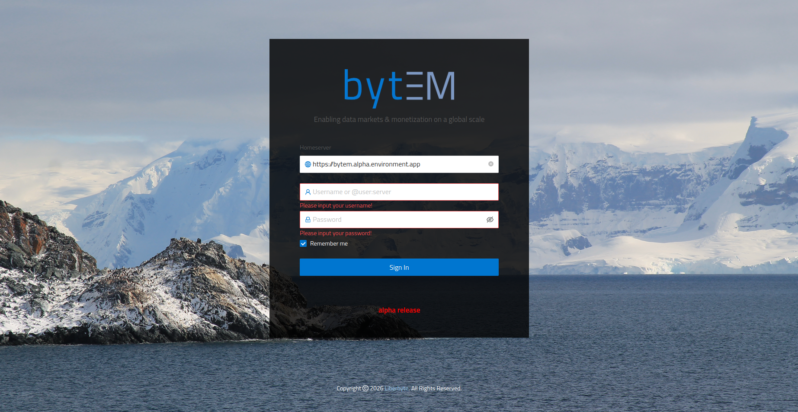

On success you land on the **Overview** page. If login fails, double-check your credentials with your administrator, or try a hard refresh (Ctrl+Shift+R).

> Public Demand Rooms can also be accessed by any federating Matrix account (e.g. `@user:matrix.org`) when your bytEM server has federation open or whitelisted to that account's server.

---

## 4. Overview Page

**URL:** `https://<your-bytem-domain>/overview`

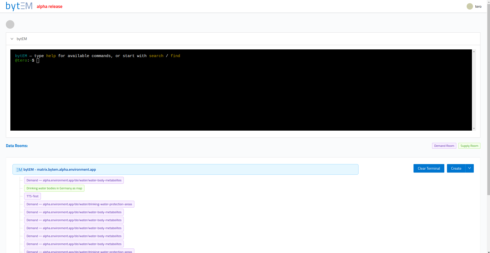

### The Terminal

A command-line interface for your account. Type `help` to see the commands available in the current context. It's also available inside individual Supply and Demand rooms, with extra room-specific commands (see [Section 13](#13-terminal-commands-reference)).

### Data Rooms List

Shows every Supply and Demand room you belong to.

| Tag | Meaning |
|---|---|
| 🟢 Green | Supply Room |
| 🟣 Purple | Demand Room |
| 🟢 Light green | You're not a member yet — click to join |

Click a room to open a context menu:

| Option | What it does |
|---|---|
| **Open Data Room** | Opens the room's editor |
| **Edit Data Room Name** | Renames the room |
| **Copy Room ID** | Copies the room's Matrix ID |
| **Leave Data Room** | Removes you from the room (room and data stay) |
| **Delete Data Room** | Permanently deletes the room and its data |

> **Note:** if you've just typed in the terminal, it still holds keyboard focus and clicking a room tag does nothing. Click a neutral spot (e.g. the **DATA ROOMS:** label) first, then click the room tag.

### Buttons

| Button | Action |
|---|---|
| **Create ▾** | Opens the Create Data Room dialog |
| **Clear Terminal** | Clears the terminal's output history only |

---

## 5. Step 1 — Decide What You're Supplying

Before creating anything, decide how each piece of your data is best supplied. bytEM supports three supply types:

| Type | Use when… |
|---|---|
| **Dataset** | You have a file (e.g. a PDF, CSV, or other data file) to upload directly |
| **API** | Your data is already served live by an API — you attach its endpoint definition instead of a static file |
| **URL reference** | The data already exists publicly somewhere (a document, a page) and you want to point to it instead of uploading a copy |

**Why this matters:** matching the type to what you actually have avoids duplicating data you don't need to duplicate, and keeps your Supply Room accurate as the source updates.

**Water quality example:** each city supplies its own raw water quality readings as a **dataset** — a file with that city's measured values.

---

## 6. Step 2 — Split Your Data into Supply Rooms

**Why:** one Supply Room = one DEID = one identity. Bundling unrelated data into a single room makes it impossible to reference just the part you need later, so split your data into one room per distinct thing.

**How:**

1. On the Overview page, click **Create ▾** → **Create Data Room**.
2. Set **Room Base Type** to `supply`.
3. Fill in the dialog:

| Field | Description |
|---|---|
| **Room Base Type** | `supply` |
| **Data Room Name** | A human-readable name, e.g. `Frankfurt Water Quality` |
| **Room Description** | What this room is for, e.g. `Water quality readings for Frankfurt` |
| **Data Room Alias** | Auto-suggested — keep it as-is |
| **Room Type** | Choose `dataset` unless you know you need a different entity type |
| **DEID URL** | The identity for this data (see [Step 3](#7-step-3--identify-and-classify-each-supply-room)) — pre-filled with your instance's base domain |
| **Public or Private** | **Private** is typical for a Supply Room |

4. Click **Create**. The room appears in your Data Rooms list, tagged 🟢.

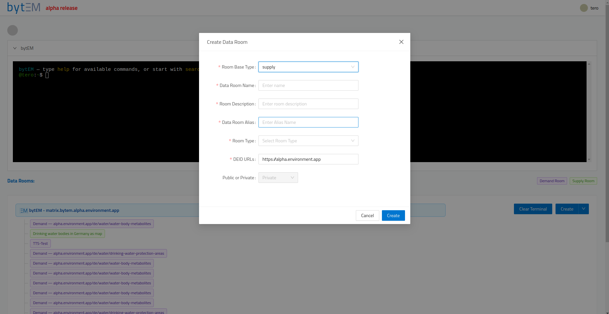

**Water quality example:** create one Supply Room per city (`Frankfurt Water Quality`, `Wiesbaden Water Quality`, …), plus one Supply Room each for the shared **benchmark** (the thresholds that define "good" vs. "poor" per parameter) and the **interpretation rules** (how to compare a reading against the benchmark).

---

## 7. Step 3 — Identify and Classify Each Supply Room

**Why:** the DEID and Class are what make a room's data discoverable and referenceable by a product later. A room without them is invisible from the index.

Open the room (🟢 tag → **Open Data Room**).

### Setting the DEID

```bash
room-deid --schema      # Fetch the DEID template for this room
room-deid --save        # Save it (or click the Save button in the editor)
```

The `deid` value is a URL on your organisation's own domain (no `bytem.` prefix). For example, if your organisation publishes at `waterworks.example`:

```
https://waterworks.example/de/frankfurt/water-quality
https://waterworks.example/de/water-quality-benchmark
https://waterworks.example/de/water-quality-interpretation
```

The path after the domain can be anything that meaningfully describes the data.

> **Note:** once data has been uploaded to a room, its DEID is locked and cannot be changed. Decide your DEID before uploading.

### Setting the Class

```bash
room-class --schema     # Fetch the Class template
room-class --save       # Save it (or click the Save button in the editor)
```

- **domain** — your organisation's own domain (same rule as DEID).
- **class** — a category for your data, e.g. `water-quality`.
- **uri** — a URL describing this specific entry; reusing the room's own DEID here is a safe choice.

> **Note:** you're not limited to predefined categories — your organisation can publish and use its own Classes, as long as they follow valid Class syntax. This is what lets your own schemas and classifications become part of a bytEM data product, rather than being limited to examples bytEM ships with.

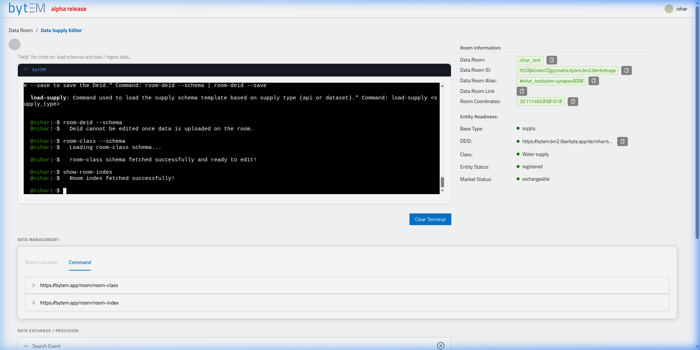

---

## 8. Step 4 — Upload Your Data and Make It Exchangeable

**Why:** a Supply Room isn't usable by anyone else until its data has actually been uploaded and pushed.

**How:**

1. Load your data:
   ```bash
   load-supply dataset     # opens a file picker, or accepts a URL to link instead of upload
   ```
   Or use the **Files** tab: **via File System** to upload, **via URL** to link a public source, or **Download from bytEM** to pull a file back down.

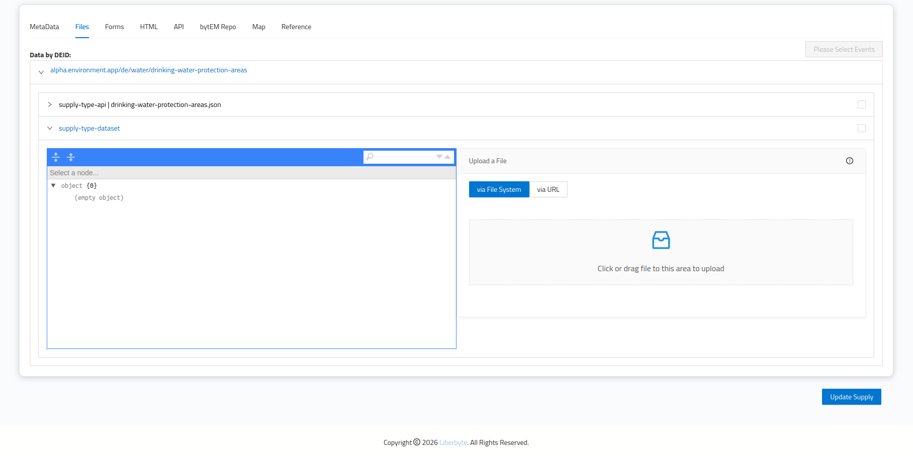

2. Click **Update Supply** (bottom right) to push your changes.
3. Check the **Entity Readiness** panel — five indicators should turn green: Base Type, DEID, Class, Entity Status, Market Status. See [Section 15](#15-status-indicators--what-the-colors-mean) for what each color means.

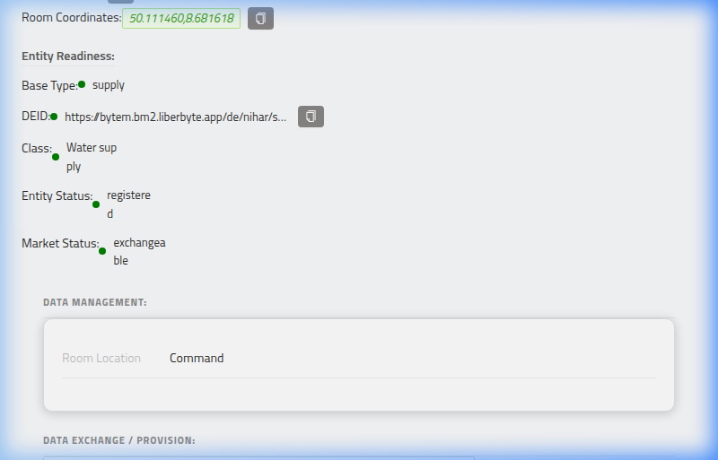

Once **Market Status** shows `exchangeable`, the room is listed at `https://<your-bytem-domain>/pwa/index-room` and can be requested by others.

**Water quality example:** repeat this for every city, plus the benchmark and interpretation rooms. Each is now independently supplied and exchangeable — but on its own, each is still just raw data, not yet a product.

---

## 9. Step 5 — Connect Data with References to Build the Product

This is the step that actually creates a **data product**, as opposed to a set of unrelated Supply Rooms. Refer back to [Core Concepts](#2-core-concepts): a DEID becomes a product the moment its references point at other DEIDs.

**How:**

1. Create one more Supply Room — this one represents the product itself (e.g. `Water Quality Index`).
2. Open its **References** tab (next to MetaData, Files, Forms, HTML, API, bytEM Repo, and Map).
3. Add a reference to each DEID this product depends on: every member city, the benchmark, and the interpretation rules.
4. Look up any referenced DEID's own details at any time with:
   ```bash
   find <deid_url>          # e.g. find https://waterworks.example/de/frankfurt/water-quality
   ```

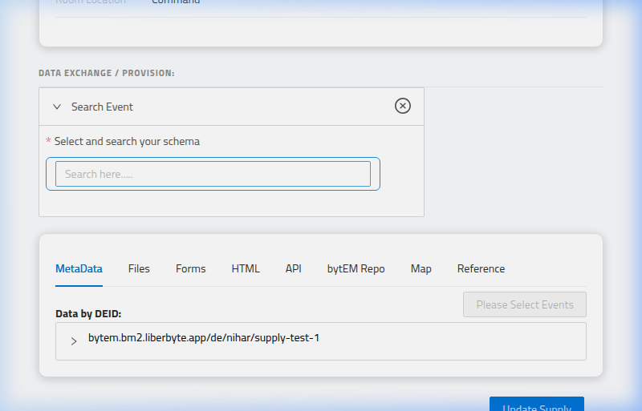

**Water quality example:** the `Water Quality Index` product references:
- `https://waterworks.example/de/frankfurt/water-quality` (and every other member city)
- `https://waterworks.example/de/water-quality-benchmark`
- `https://waterworks.example/de/water-quality-interpretation`

That's the entire product definition — no code involved. The actual processing — exchanging in each referenced piece and, where recognised, computing a result from them — is carried out automatically by the bytEM bot when the product is requested, not by anything you run yourself. For this particular shape of product (member cities + a benchmark + interpretation rules), the bot already knows how to combine the referenced data into a computed result — see the next step. For a product shape bytEM doesn't yet have a result-builder for, requesting it still returns all the referenced data via the bot's exchange, just not turned into a computed result automatically.

---

## 10. Step 6 — Request (Demand) a Product

> ⭐ **This is the recommended way to get data.** A Demand Room you create manually has no reference DEID, so `find`/`exchange-data` have nothing to act on inside it. Always start from the index below.

**How:**

1. Open `https://<your-bytem-domain>/pwa/index-room`.

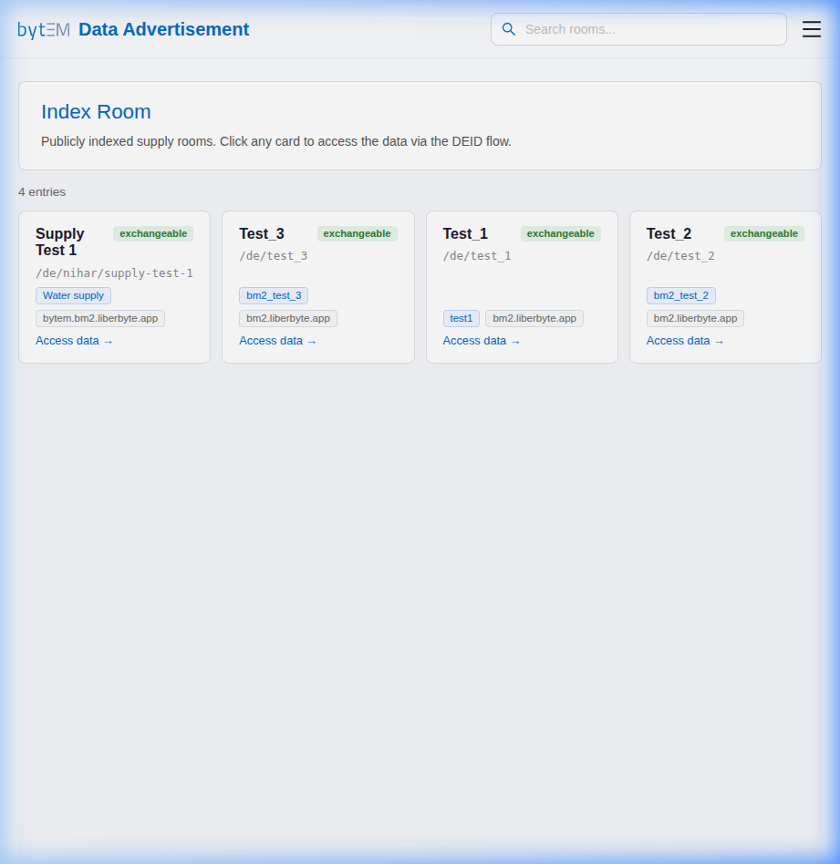

2. Find the product's listing and click **Access data →**. This opens a public page — no login required yet. Its **Dataset Info** panel shows the DEID's **Type** — `product` for something built from references, `dataset`/`api`/etc. for plain supply — so you can confirm you're requesting the right kind of thing before filling in the form.
3. Fill in the short form:

| Field | Required? | Notes |
|---|---|---|
| **Matrix username** | Yes | Your existing Matrix account — this flow doesn't create one for you |
| **Email** | No | Optional, for your own records |
| **Location** | Yes | Click a point on the map or type coordinates; pre-filled if the product already has one |

4. Click **Access My Data Room**.

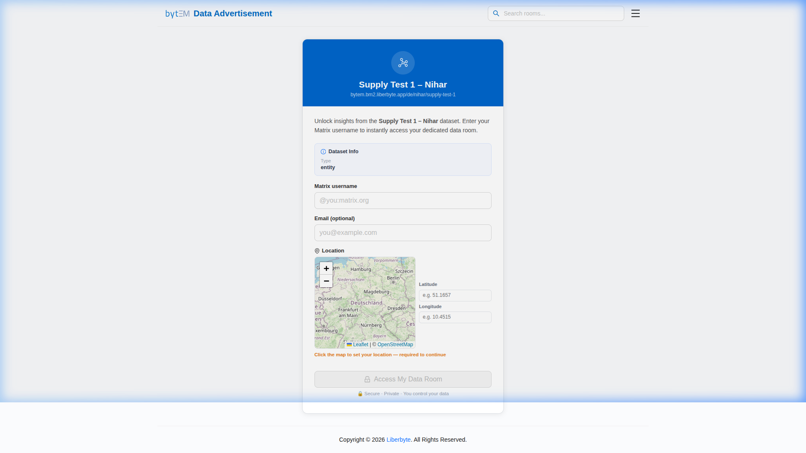

5. A live checklist walks through creating the Demand Room, setting its DEID, resolving supply, exchanging the data, setting permissions, and inviting you.
6. Once it reaches **Done**, click **Explore `<DEID>` by bytEM** to log in and land directly in your new Demand Room.

**What happens for the water quality example:** requesting the `Water Quality Index` product triggers bytEM to exchange in every referenced member city's data, fetch the benchmark and interpretation rules, and — because this reference shape is already recognised — build a comparison result automatically.

---

## 11. Step 7 — See Your Result

Open your Demand Room (🟣 tag → **Open Data Room**) and check the **Exchanged** tab, which contains its own sub-tabs depending on what was returned:

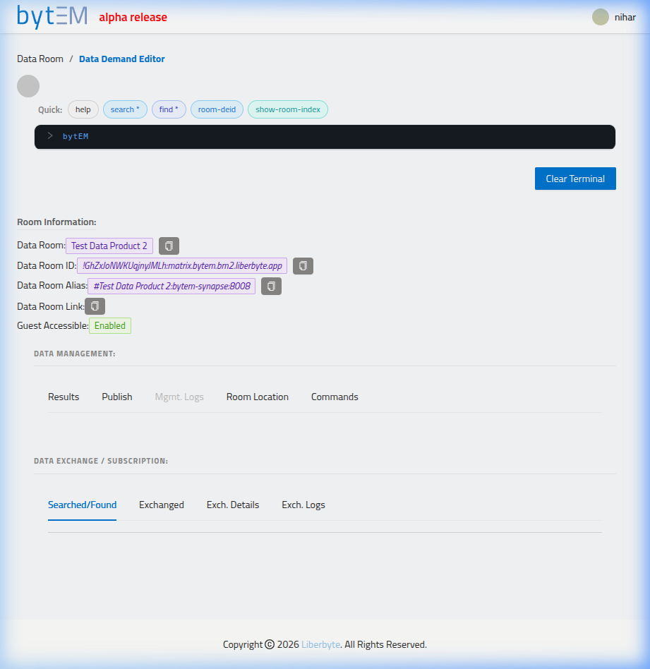

| Inner tab | Shown when… |
|---|---|
| **MetaData** | Always — the full record of what was exchanged |
| **Reference** | Exchanged data includes reference-type content |
| **Map** | Exchanged data includes geographic information |
| **HTML** | Exchanged data includes web/HTML content |
| **API** | Exchanged data includes API content |
| **bytEM Repo** | Downloadable files/assets exist |
| **Echart** | A computed result was produced — renders as a chart |

**Water quality example:** the **Echart** tab shows the finished result — each city's readings compared against the benchmark using the interpretation rules, rendered as a chart — rather than raw numbers from every city individually.

If you don't see an **Echart** tab, it means the product you requested references data in a shape bytEM doesn't yet have a computed result for — you'll still have every referenced piece available in **MetaData**.

---

## 12. Step 8 — Compose Products: Reuse a Product Inside Another Product

Steps 1–7 built one product (`Water Quality Index`) from raw supply. This step shows the other half of the pattern: a finished product's DEID is just another DEID, so it can be referenced by a *second* product exactly the way a plain supply room can. This is how you build bigger products without re-uploading or re-referencing anything that already exists.

**Why:** once `Water Quality Index` exists and is exchangeable, anyone building a larger product — including you — can pull it in as a single reference instead of listing every member city again. Reference the product, not its parts.

**How:**

1. Create one more Supply Room for the new, higher-level product (e.g. `Public Health Water Dashboard`).
2. Set its **DEID** and **Class** as usual (see [Step 3](#7-step-3--identify-and-classify-each-supply-room)) — e.g. `https://waterworks.example/de/public-health-water-dashboard`.
3. Open its **References** tab.
4. Add a reference to the **DEID of the first product** — `https://waterworks.example/de/water-quality-index` — the same DEID anyone would use to demand it directly. You are referencing the whole finished product, not the individual cities inside it.
5. Add any further references the new product needs, e.g. another existing supply room such as population-density data.
6. Click **Update Supply** to publish the new product.

**Water quality example:** `Public Health Water Dashboard` references:
- `https://waterworks.example/de/water-quality-index` (the product from Steps 1–7, referenced as a single unit)
- `https://health.example/de/population-density` (a plain supply room)

Requesting `Public Health Water Dashboard` (via [Step 6](#10-step-6--request-demand-a-product), same as any other product) makes bytEM resolve both references — including resolving `Water Quality Index`'s own references in turn — and return the combined result.

**Key idea:** there's no functional difference between referencing a plain supply DEID and referencing a product DEID. Build a small product once, then reuse it inside as many larger products as you need — the reference is what composes them, nothing needs to be copied or redefined.

---

## 13. Terminal Commands Reference

Available on the Overview page, inside Supply Rooms, and inside Demand Rooms. Type `help` at any time to see what's available in the current context — always trust the live output over this list.

**Tags used below:** ✅ active · ⚙️ processed by the bytEM bot · ⛔ disabled in the current version.


### Common (all contexts)

```bash
help                                          # ✅ list available commands
clear                                         # ✅ clear the terminal window
delete-room --room-id <room_id>               # ✅ delete a room entirely (irreversible)
room-location --schema [--lat <lat> --lon <lon>]   # ⚙️ set/update the room's location
```

### Supply Room

```bash
room-deid --schema              # ✅ fetch this room's DEID template
room-deid --save                # ⚙️ save the DEID
room-class --schema             # ✅ fetch this room's Class template
room-class --save               # ⚙️ save the Class
load-supply <supply-type>       # ⚙️ load a supply template (dataset, api, html, …) and add data
show-room-index                 # ✅ show this room's index state event
```

### Demand Room

```bash
find <deid_url>                 # ✅ list data for a specific DEID
exchange-data <deid_url>        # ⚙️ run a one-off exchange for the given DEID / checked results
download <media-repo-URL>       # ✅ download a specific file
download *                      # ✅ download every event-type that has files, zipped
download                        # ✅ download just the checked event-types
```

> `find *`, the field-scoped `find <field> <value>`, and `search` are ⛔ disabled in the current version. Use `find <deid_url>` (or the **Reference** tab's **See overview** button) instead.

### Removing data / rooms

```bash
delete-room --event-type <type1> <type2>   # ⚙️ remove specific event-types
delete-room --all                          # ⚙️ remove all event-types
```

---

## 14. PWA — Mobile App

**URL:** `https://<your-bytem-domain>/pwa/`

The PWA is a mobile-optimised version of bytEM, installable like a native app, and doubles as the general index entry point (the `/pwa/index-room` flow used in [Step 6](#10-step-6--request-demand-a-product)).

| Element | Description |
|---|---|
| **Header** | Branding, a search bar, and a navigation menu |
| **Index Room banner** | Explains that cards here are publicly indexed products |
| **Listing cards** | One card per exchangeable product, showing its name, status badge, DEID path, Class, and domain |

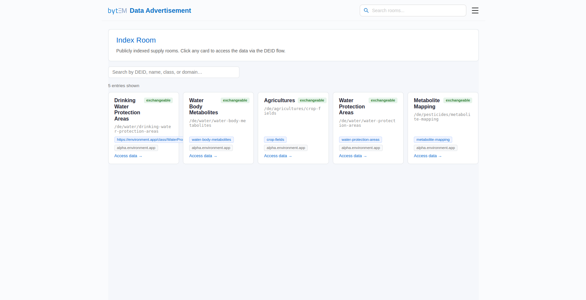

**Installing on mobile:** open the PWA URL in your mobile browser → your browser's menu → **Add to Home Screen** (iOS) or **Install App** (Android). Log in the same way as on desktop.

---

## 15. Status Indicators — What the Colors Mean

The **Entity Readiness** panel uses colored dots:

| Color | Meaning |
|---|---|
| 🔴 Red | Not yet set, or not yet confirmed |
| 🟡 Yellow | Saved on your side, waiting on network confirmation |
| 🟢 Green | Fully set and confirmed |

Room tags in the Data Rooms list: 🟢 green = Supply, 🟣 purple = Demand.

- **DEID/Class** turn green once saved and accepted — re-check after a few seconds.
- **Entity Status** commonly stays yellow even after a successful save; this reflects pending network confirmation, which can depend on factors outside the room itself.
- **Market Status** depends on your instance being connected to the wider bytEM federation — it will stay red regardless of how complete your room is if your instance isn't federated yet.

---

## 16. FAQ

**Do I need to write code to create a data product?**
No. Supplying data (dataset upload, API, or URL reference) and connecting it with references are both done through the room dialog, the terminal, or the editor UI.

**What's the difference between supplying data and building a product?**
Supplying data publishes one piece with an empty `references` list. Building a product means creating a DEID whose `references` point at other DEIDs — that's what makes something requestable as a combined result rather than a single dataset.

**Can the same DEID be both supplied and referenced by a product?**
Yes — this is the normal pattern. Each city's water quality DEID is plain supply on its own, and is also one of the references inside the water quality index product.

**Can a product reference another product, not just raw supply?**
Yes — that's exactly [Step 8](#12-step-8--compose-products-reuse-a-product-inside-another-product). A reference just points at a DEID; bytEM doesn't care whether that DEID is plain supply or itself a product with its own references. This is how bigger products get built out of smaller, already-published ones.

**Will bytEM always compute a result automatically for my product?**
Only if the shape of what you've referenced matches something bytEM already knows how to process (like the water quality example). Otherwise, requesting your product still returns every referenced piece of data — just without an automatically computed chart.

**Is my data copied into bytEM if I supply it as a URL reference?**
No — a URL reference points to the existing public source rather than uploading a duplicate.

**Can I change a DEID after creating the room?**
Yes, until data has been uploaded — after that, it's locked. Create a new room if you need a different DEID.

**Why does my manually-created Demand Room show no data?**
It has no reference DEID, so `find`/`exchange-data` have nothing to act on. Use the index/DEID flow in [Step 6](#10-step-6--request-demand-a-product) instead.

---

## 17. Troubleshooting

**Entity Status stays yellow after saving.**
Wait 10–15 seconds and refresh — confirmation happens slightly asynchronously.

**Market Status stays red even though my room is fully filled in.**
This depends on your instance being connected to the wider bytEM federation, not on your room's own completeness. Contact your administrator.

**Clicking a room tag in the Data Rooms list does nothing.**
The terminal likely still has keyboard focus from a previous command. Click a neutral area (e.g. the **DATA ROOMS:** label) first, then click the tag.

**`find *` or `search` returns nothing / errors.**
Both are disabled in the current version. Use `find <deid_url>` with a specific DEID instead.

**A command says I don't have sufficient permissions.**
Room-level commands require enough Matrix "power level" in that room. Ask the room owner/administrator.

**Something I saved (DEID, Class, a file) doesn't show up after refreshing.**
Wait roughly 10–15 seconds and refresh again. If it's still missing, contact your administrator with the room name and what you tried to save.

**My Supply Room's DEID field is locked and I can't edit it.**
Data has already been uploaded to that room — DEIDs lock once data exists, to prevent identity drift on data already in use. Create a new room if you need a different DEID.

---

## 18. Getting Help

**Matrix support room:** `#bytem-support:matrix.liberbyte.com` — join via [app.element.io](https://app.element.io) → **Explore** → enter the room address → **Join**.

**Within the app:** type `help` in any terminal (Overview, Supply Room, or Demand Room) for the commands available in that context — always the most current source.

---

*User guide prepared for bytEM — Liberbyte GmbH © 2026*
