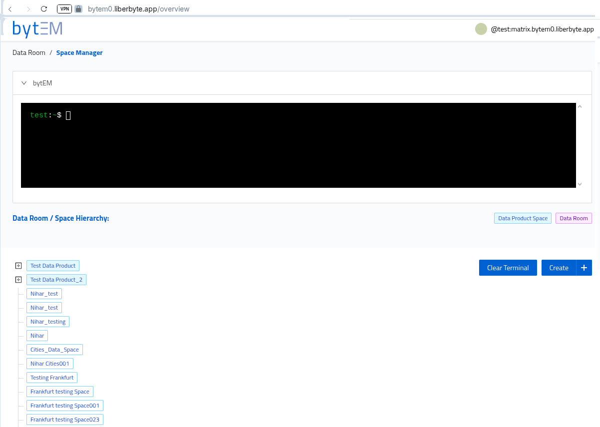

# bytEM-public
bytEM public repo - bytEM from Liberbyte GmbH 


## About bytEM

bytEM is a secure, decentralized data management framework, sometimes describe  as “dmail i.e. email for data” easily enabling sharing, exchanging and also monetizing the data, Developed by [Liberbyte GmbH](https://liberbyte.com).

- [bytEM Product Overview Website](https://liberbyte.com/bytEM.html)
- Or Download the project overview (PDF) for a printable summary:
 [bytEM Overview (PDF)](documentation_screenshots/bytem_overview.pdf)

- [Contact Us](https://liberbyte.com/contact)

Learn more about our secure communication solutions for organizations and businesses.

## Quick Access

Scan this QR code to access the bytEM repository:


Or visit: [github.com/liberbyte/bytEM-public](https://github.com/liberbyte/bytEM-public)

## Quick Start

1. **Install Docker & Docker Compose**
2. **Clone this repository**
3. **Run environment setup:** `sudo ./env_setup.sh`
4. **Run installer:** `sudo ./install.sh`
5. **Run SSL setup:** `sudo ./certbot.sh`
6. **Run whitelist sync:** `sudo ./whitelist-sync.sh`
7. **Create your first bytEM (Matrix) user**
8. **Test your installation (Nginx, bytEM login page, user login)**
---

## Prerequisites

- Virtual Machine: recommended minimum spec, example: 2 Cores, 8GB RAM, 80 GB disk space
- Ubuntu 24.04 server
- Domain/subdomain for your installation (bytEM requires its own IP address / domain)
- Customize credentials for bot user, RabbitMQ, Synapse, etc.

---

## Step-by-Step Installation
- We have written 4 bash scripts (env_setup.sh, install.sh, certbot.sh and whitelist-sync) to automate the process of setting up and installing the application bytEM.
- The main goal for these scripts is to generate the config files from the template files, run the containers and required first run commands, generate SSL certificates, and configure federation/IP whitelisting.
- All these scripts perform a certain set of tasks. Details of the tasks performed are as below -

<!-- ### ssh into the VM server -->


### Install Docker and Docker Compose


#### Optional: Move Docker Data to Dedicated Storage

If your server has a dedicated storage volume (e.g., `/xxx-liberbyte`), you can move Docker's data directory to prevent filling up the root filesystem. **Do this BEFORE running `env_setup.sh` or `install.sh`.**

```sh
# Stop Docker service
sudo systemctl stop docker

# Create directory on dedicated storage
sudo mkdir -p /xxx-liberbyte/bytem/docker

# Move Docker data to dedicated storage
sudo mv /var/lib/docker /xxx-liberbyte/bytem/docker

# Create symlink
sudo ln -s /xxx-liberbyte/bytem/docker /var/lib/docker

# Start Docker service
sudo systemctl start docker

# Verify Docker is using the new location
sudo docker info | grep "Docker Root Dir"
# Should show: Docker Root Dir: /xxx-liberbyte/bytem/docker

# Navigate to dedicated storage and clone bytEM repository
cd /xxx-liberbyte
```

**Benefits:**
- Prevents root filesystem from filling up
- All Docker data (images, containers, volumes) stored on large dedicated storage
- Installation proceeds normally - no changes to `env_setup.sh` or `install.sh` needed

<!--  -->


```sh
sudo apt update
sudo apt install docker docker-compose

git clone https://github.com/liberbyte/bytEM-public.git
cd bytEM-public
```


### 1. env_setup.sh -

This script is the first one to run when setting up the bytEM application.  The main goal of this script is to generate the env variables and other config files to be used by the application as below -

- Generation of directory named 'generated_config_files'
- Generation of subdirectories
_'generated_config_files/nginx_config' and_
_'generated_config_files/synapse_config'_
- Generation of config files from template files in the folder 'config_templates' and putting them in respective sub-directories.
- Generation of '.env.bytem' file from the template file '.env.template' .
- If there is already a file present named '.env.bytem' (from old installation), the old .env.bytem will be backed up by asking the user if he wants to back up the old file or not.

run this script first by
```bash
 sudo ./env_setup.sh
```
when prompted enter the following:

- Enter your subdomain (e.g., [liberbyte.app])
- Enter your prefix (e.g., [bm4])
- Custom credentials for bot user, rabbitmq, synapse, etc ...

<!--  -->


<!-- ### 2. login to docker hub


 -->

### 3. Run installer: install.sh -


```bash
 sudo ./install.sh
```
This script is the second step to run when setting up the bytEM application. The main goal of this script is to pull all images and run all the containers in the bytEM stack in docker-compose.yaml, and register first admin user for matrix synapse as below -

- Changing ownership permission of directory 'generated_config_files' to 991 so that bytem-synapse container can use the homeserver.yaml and log.config file.
- Start the docker containers by executing docker compose commands.
- Register the first matrix synapse admin user by executing 'register_new_matrix_user' command inside 'bytem-synapse container'
- Restart the container bytem-be and bytem-bot for the changes to take effect

<!--  -->


### 4. check the docker containers

```bash
sudo docker ps
```


we see all docker containers are up and running successfully

<!--  -->


### 5. Run SSL Setup: certbot.sh -


```bash
sudo ./certbot.sh
```

This script is the third step to run when setting up the bytEM application. The goal of this script is to perform 3 tasks -

- Generate the SSL certificates and apply them to the nginx running in bytem-app container.
- Generating a login token and placing that token in .env.bytem file generated in first step.
- Override the ratelimit of matrix synapse server.
- Restarts necessary containers to apply the changes.


### 6. Run Whitelist Sync

To keep your federation whitelist and `/solr` endpoint secure, run the whitelist sync script:

```bash
sudo ./whitelist-sync.sh
```


This script will: -

- Fetch the latest list of allowed domains from the bytEM registry.
- Update your homeserver.yaml with the correct federation whitelist.
- Restrict access to the /solr endpoint in Nginx so only bytEM servers can connect.
- Reload the Nginx configuration inside the Docker container.

## More Details About bytEM Installation (Optional)

This section provides a deeper look at how bytEM is packaged and orchestrated behind the scenes.  
You do not need to understand or modify these details for a standard installation, but they may be useful for advanced users or troubleshooting.

---

### Docker Images Used

bytEM uses several Docker images for its services:

```bash
REPOSITORY             TAG                   IMAGE ID       CREATED             SIZE
bytem-app              latest                208ed7919084   23 minutes ago      292MB
bytem-be               latest                9472fd408ec4   25 minutes ago      2.1GB
bytem-bot              latest                37d0118c4688   About an hour ago   378MB
postgres               14-alpine             fb250e5b8f7b   2 weeks ago         278MB
matrixdotorg/synapse   v1.123.0              0a805e026713   7 months ago        418MB
rabbitmq               3-management-alpine   699b570c4b87   12 months ago       176MB
solr                   9.5.0                 579a59112bcc   19 months ago       580MB
```

- Dockerfile.backend builds the Exchange server image.
- Dockerfile.bot builds the bot image.
- Dockerfile.bytemApp builds the React front-end (served by Nginx, includes certbot for SSL automation).

### Container orchestration -

- All services are managed using Docker Compose (docker-compose.yaml).
- This file defines the containers and how they interact.

### Services (Containers) and Ports Binding:

- The names of current services (containers) in the stack are as follows -
- The Ports used by current services (containers) in the stack and their bindings with the host port are as follows. The format is - _(&lt;host_port&gt;:&lt;container_port&gt;)_ -

<table>
<thead>
<tr>
<th>Sr. No.</th>
<th>Service (Container) Name</th>
<th>Details</th>
<th>Port Binding</th>
</tr>
</thead>
<tbody><tr>
<td>1.</td>
<td>bytem-app</td>
<td>React Front-end</td>
<td>80:80<br>443:443</td>
</tr>
<tr>
<td>2.</td>
<td>bytem-be</td>
<td>Exchange server (node js?)</td>
<td>9999:9999 (FE port)<br>3000:3000 (Exchange port)</td>
</tr>
<tr>
<td>3.</td>
<td>bytem-bot</td>
<td>Bot(s)</td>
<td>4000:4000</td>
</tr>
<tr>
<td>5.</td>
<td>bytem-rabbitmq</td>
<td>RabbitMQ queues</td>
<td>5672:5672 (Server port)<br>15672:15672 (UI port)</td>
</tr>
<tr>
<td>6.</td>
<td>bytem-solr</td>
<td>Apache Solr (search engine)</td>
<td>8983:8983</td>
</tr>
<tr>
<td>7.</td>
<td>bytem-synapse</td>
<td>Matrix Synapse server</td>
<td>8008:8008 (Default)<br>8009:8009 (sliding sync)<br>8448:8448 (federation)</td>
</tr>
<tr>
<td>8.</td>
<td>bytem-synapse-db</td>
<td>Postgres DB used by matrix synapse server</td>
<td>5432:5432</td>
</tr>
</tbody></table>


### Volumes -

- There are some persistent volumes mounted on containers to persist the data from the container filesystem on the host machine filesystem -

- bytem-rabbitmq-data - Volume used by container 'bytem-rabbitmq' to persist the data of RabbitMQ server.
- Bytem-rabbitmq-log - Volume used by container 'bytem-rabbitmq' to persist the logs of RabbitMQ server
- Bytem-synapse-db-data - Volume used by container 'bytem-synapse-db' to persist the data of postgresDB used by Matrix synapse server.

Apart from above named volumes, We have some directories mounted from host machine to the containers. Details of them are as below -

- **solr/ -** This directory in the root of the project is created by container bytem-solr and then is mounted inside the container bytem-bot to be used to share the data of solr cores between both the containers.
- **generated_config_files/ -** This directory is created in the root of the project by (env_setup.sh) to generate .env.bytem file and synapse and nginx config files. This directory is mounted inside the containers bytem-app, and bytem-synapse so that the generated nginx config files and synapse homeserver.yaml are available for both the containers to use.
- **certbot/ -**  This directory will include generated SSL Certificates. This directory is mounted inside bytem-app container.
- **.env.bytem -** This is env variables file used to determine the config options needed for the bytEM to function. This file is generated in the root of the project when we run the first bash script (env_setup.sh). This file is mounted inside the containers bytem-be and bytem-bot.


## Matrix User & Server Management Guide

This section helps you test your Matrix installation and manage users on your bytEM server.


## 7. Create Your First bytEM User (Required)

Creating a bytEM user (Matrix user) is required to start using bytEM and to test your installation.

**Interactive method:**
```sh
sudo docker exec -it bytem-synapse register_new_matrix_user -c /data/homeserver.yaml http://localhost:8008
```
- You will be prompted for:
  1. Username (e.g. `test`)
  2. Password (e.g. `test`)
  3. Whether to make the user an admin (`yes` recommended for first user)

**Non-interactive method (example):**
```sh
sudo docker exec -it bytem-synapse register_new_matrix_user \
  -c /data/homeserver.yaml \
  --user test \
  --password "test" \
  --admin \
  http://localhost:8008
```
- This creates an admin user `@test:your-domain` with password `test`.

---

## 8. Test Your Installation (Required)

After installation, perform these checks to confirm everything is working:

### 1. **Nginx Test**
- Open your bytEM domain in a browser (e.g. `https://matrix.bytem.your-domain.app`)
- You should see the bytEM login page.
- If the page does not load, Nginx or SSL setup may have failed.


### 2. **bytEM Login Page Test**
- Go to the bytEM login page (e.g. `https:/bytem.your-domain.app/user/login`)
- Enter the user credentials you created above.
- You should be able to log in successfully.


### 3. **User Login Test**
- Use the credentials for your bytEM user (Matrix user) to log in.



- If login fails, check the Matrix Synapse container logs:
  ```sh
  sudo docker logs bytem-synapse --tail 50
  ```

---


## Support & Community

### Matrix Support Room

Join our public Matrix support room to get help with your bytEM installation:

- Room Address: `#bytem-support:matrix.liberbyte.com`
- Direct Link: [#bytem-support:matrix.liberbyte.com](https://matrix.to/#/#bytem-install-admin:matrix.liberbyte.com)


You can access this room with any Matrix client like Element:
1. Open Element: [app.element.io](https://app.element.io)
2. Click "Explore"
3. Enter `#bytem-support:matrix.liberbyte.com`
4. Join the room


Our support team is available to help with installation issues, configuration questions, and best practices.


### General Troubleshooting

- If Nginx or bytEM login page does not load, check container status:
  ```sh
  sudo docker ps
  ```
- If login fails, check Synapse logs and user creation steps.
- Ensure your domain is whitelisted and SSL certificates are valid.

---

> **Note:**  
> Replace all placeholder values in commands:
> - `your-domain`: Your actual domain/subdomain
> - `USERNAME`: The Matrix/bytEM username (e.g. `test`)
> - `PASSWORD`: The password you set for the user

---

**With these steps, you can verify your bytEM installation and ensure user login is working.**

---

<!-- 
## Complete Cleanup (Remove All Containers and Images, if you want to reinstall bytEM fresh)


### 1. Stop and Remove All Containers
```bash
sudo docker stop $(sudo docker ps -aq)
sudo docker rm $(sudo docker ps -aq)
```

### 2. Remove All Docker Images
```bash
sudo docker rmi $(sudo docker images -q)
```

### 3. Remove All Volumes (Optional - This will delete all data)
```bash
sudo docker volume rm $(sudo docker volume ls -q)
```

### 4. Clean Up Docker System (Remove all unused data)
```bash
sudo docker system prune -a --volumes
```

> **Warning:** These commands will permanently delete all Docker containers, images, and volumes on your system. Make sure to backup any important data before running these commands. -->
